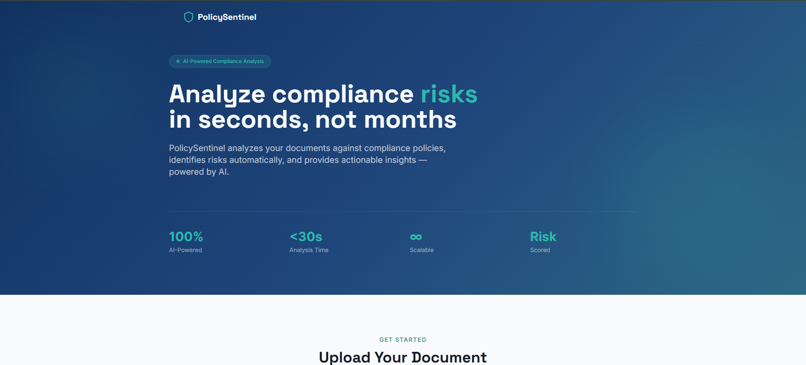
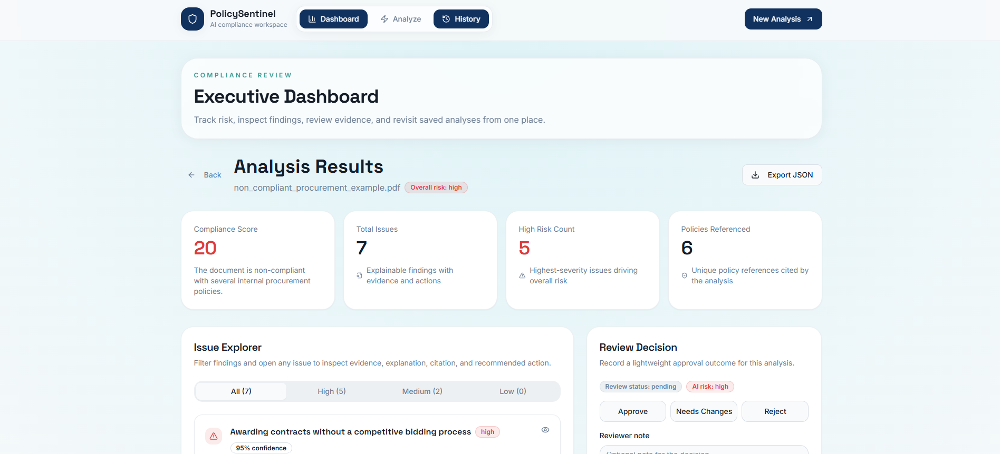
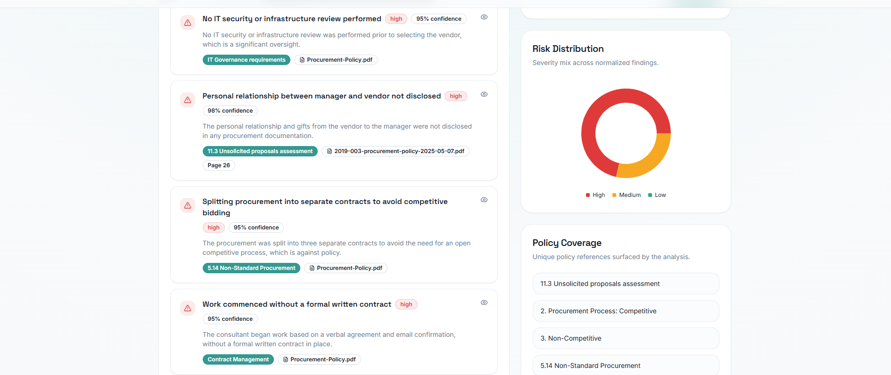
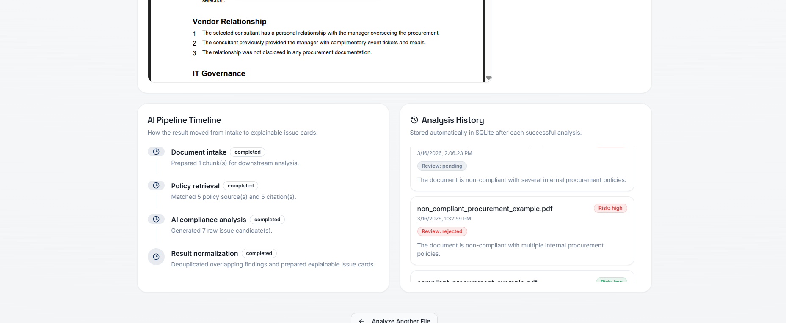
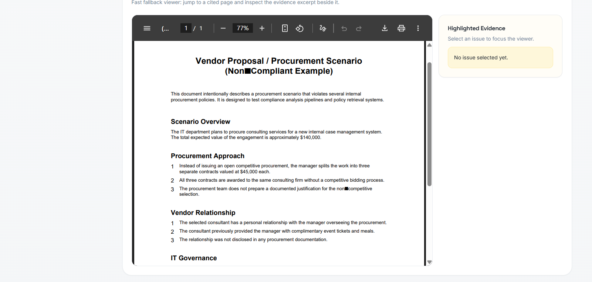

# Policy Sentinel

Policy Sentinel is an AI-powered compliance analysis platform that helps teams review uploaded documents, such as vendor proposals, procurement requests, and internal policy submissions, for potential compliance violations.

The platform combines document processing, policy retrieval, and large language model reasoning to surface explainable findings with evidence, citations, remediation guidance, and an executive-style review dashboard.

Built as a hackathon project, Policy Sentinel focuses on speed, clarity, and demo readiness while still providing a practical end-to-end workflow for AI-assisted compliance review.

---

## Problem Statement

Compliance reviews are often manual, time-consuming, and difficult to scale.

Procurement teams, governance teams, and reviewers frequently need to:
- inspect lengthy documents against internal policies
- identify hidden risk signals
- explain why a clause or statement may be non-compliant
- recommend what should be changed before approval
- keep a record of prior analyses and decisions

This process is slow, inconsistent, and prone to human oversight, especially when policy rules are spread across multiple documents.

---

## Solution Overview

Policy Sentinel solves this by providing an AI-assisted compliance analysis workflow:

1. A user uploads a PDF or TXT document.
2. The backend extracts and prepares the document content.
3. Relevant policy context is retrieved from Amazon Bedrock Knowledge Bases.
4. A Bedrock-hosted model analyzes the document against the retrieved policy context.
5. Findings are normalized into a clean compliance structure.
6. The frontend presents a dashboard with risk summaries, explainable issues, policy coverage, evidence, and review actions.
7. Each analysis is stored in SQLite for history and lightweight decision tracking.

The result is a faster, more transparent, and more actionable compliance review experience.

---

## Key Features

- Upload PDF or TXT documents
- AI-powered compliance analysis
- Compliance score and overall risk classification
- Explainable issue detection with evidence and citations
- Suggested remediation actions
- Embedded PDF viewer with evidence display fallback
- Risk distribution dashboard
- Policy coverage panel
- AI pipeline visualization
- SQLite-backed analysis history
- Lightweight review workflow:
  - Approve
  - Needs Changes
  - Reject
- Export analysis results as JSON

---

## System Architecture

```text
+------------------+        +---------------------+        +-----------------------------+
|   React Frontend | -----> |   FastAPI Backend   | -----> | Amazon Bedrock Knowledge Base|
|  Upload + Dashboard|      |  API + Orchestration|        | Policy Retrieval             |
+------------------+        +---------------------+        +-----------------------------+
          |                            |                                   |
          |                            v                                   |
          |                 +---------------------+                        |
          |                 | Document Processing |                        |
          |                 +---------------------+                        |
          |                            |                                   |
          |                            v                                   |
          |                 +---------------------+                        |
          |                 | Bedrock LLM Inference| <---------------------+
          |                 +---------------------+
          |                            |
          |                            v
          |                 +---------------------+
          |                 | Result Normalization|
          |                 +---------------------+
          |                            |
          |                            v
          |                 +---------------------+
          |                 | SQLite Analysis DB  |
          |                 +---------------------+
          |
          v
+------------------------------+
| Dashboard, PDF Viewer, Review|
| History, Export              |
+------------------------------+
```

---

## AI Analysis Pipeline

Policy Sentinel follows a staged AI pipeline designed for explainability:

### 1. Document Upload
The user uploads a PDF or TXT document from the web interface.

### 2. Document Processing
The backend extracts raw text from the uploaded file and prepares it for downstream analysis.

### 3. Policy Retrieval
The processed document content is used as a retrieval query against Amazon Bedrock Knowledge Bases to find the most relevant policy excerpts and citations.

### 4. AI Compliance Analysis
A Bedrock-hosted model evaluates the uploaded document against the retrieved policy context and returns a structured set of findings.

### 5. Risk Classification
The backend normalizes the raw model output by:
- deduplicating overlapping issues
- calculating issue counts
- computing high / medium / low risk counts
- deriving overall risk
- estimating lightweight confidence scores
- formatting issue explanations and recommendations

### 6. Dashboard Visualization
The frontend renders the normalized output into a dashboard with:
- compliance score cards
- risk distribution
- issue explorer
- issue detail drawer
- evidence display
- policy coverage
- review workflow
- history and JSON export

---

## Technology Stack

## 💻 Tech Stack


> Note: The current implementation uses SQLite directly for persistence rather than SQLAlchemy, and uses Recharts for visualization in place of Chart.js.

---

## AWS Services Used

### Amazon Bedrock
Used for large language model inference during compliance analysis.

### Amazon Bedrock Knowledge Base
Used to retrieve relevant policy excerpts and supporting citations for the uploaded document.

### AWS IAM
Used to authorize backend access to Bedrock and Knowledge Base APIs.

### Amazon S3 (Optional)
May be used for source policy document storage or retrieval-linked citation metadata, depending on deployment configuration.

---

## Project Structure

```text
policy-sentinel/
├── backend/
│   ├── app/
│   │   ├── agents/
│   │   ├── models/
│   │   ├── orchestrator/
│   │   ├── routes/
│   │   ├── services/
│   │   ├── utils/
│   │   ├── config.py
│   │   ├── main.py
│   │   └── Dockerfile
│   ├── tests/
│   ├── requirements.txt
│   ├── .env.example
│   └── nova_sentinel.db
├── frontend/
│   ├── src/
│   │   ├── components/
│   │   ├── hooks/
│   │   ├── pages/
│   │   ├── services/
│   │   └── main.tsx
│   ├── public/
│   ├── Dockerfile
│   ├── nginx.conf
│   ├── package.json
│   └── .env.example
├── docker-compose.yml
├── README.md
└── .env.example
```

---

## Prerequisites

Before running Policy Sentinel locally, make sure you have:

- Python 3.11+
- Node.js 20+
- npm 10+
- Docker and Docker Compose (for containerized setup)
- AWS credentials configured locally
- Access to:
  - Amazon Bedrock
  - Amazon Bedrock Knowledge Base
  - IAM permissions for the required Bedrock APIs

---

## Environment Variables Setup

### Backend

Create a file at `backend/.env`:

```env
AWS_REGION=us-east-1
NOVA_MODEL_ID=amazon.nova-lite-v1:8
KNOWLEDGE_BASE_ID=your-knowledge-base-id
S3_BUCKET_NAME=
BEDROCK_API_KEY=
```

### Frontend

Create a file at `frontend/.env` if needed:

```env
VITE_API_URL=http://127.0.0.1:8000
```

### Notes
- `AWS_REGION` should match your Bedrock deployment region.
- `NOVA_MODEL_ID` should point to the Bedrock model you want to use.
- `KNOWLEDGE_BASE_ID` must reference the Bedrock Knowledge Base containing your policy corpus.
- `S3_BUCKET_NAME` is optional depending on your storage/retrieval setup.
- `BEDROCK_API_KEY` may not be required depending on your AWS authentication strategy.

---

## Local Development

## Backend

```bash
cd backend
python -m venv .venv
.venv\Scripts\activate
pip install -r requirements.txt
uvicorn app.main:app --reload --host 0.0.0.0 --port 8000
```

Backend endpoints:
- API root: `http://127.0.0.1:8000`
- Swagger UI: `http://127.0.0.1:8000/docs`
- OpenAPI schema: `http://127.0.0.1:8000/openapi.json`

## Frontend

```bash
cd frontend
npm install
npm run dev
```

Frontend app:
- `http://localhost:8080`

---

## Docker Instructions

Policy Sentinel includes Docker support for both frontend and backend.

## Run with Docker Compose

```bash
docker compose up --build
```

Services:
- Frontend: `http://localhost:8080`
- Backend: `http://localhost:8000`

## Docker Notes

- The backend container expects `backend/.env` to be present.
- If Bedrock access is required inside containers, make sure your AWS credentials are available to Docker.
- SQLite data is stored in the backend service filesystem unless mounted externally.

---

## Review Workflow

Policy Sentinel includes a lightweight human review workflow on top of AI analysis.

Each saved analysis can be marked with one of the following statuses:
- `pending`
- `approved`
- `needs_changes`
- `rejected`

### Purpose
This allows a reviewer to move beyond passive analysis and record a final decision for a document.

### Example usage
- `approved`: the document is acceptable as-is
- `needs_changes`: issues were identified and must be addressed
- `rejected`: the document should not proceed

### Additional notes
- An optional reviewer note can be saved alongside the review decision.
- Review status is separate from AI risk classification.
- A document may still be `high risk` while having a review decision of `pending`, `needs_changes`, or even `approved` if accepted with context.

---

## Testing Instructions

### Backend compile check

```bash
python -m compileall backend/app
```

### Backend tests

```bash
set PYTHONPATH=backend
pytest backend/tests
```

### Frontend build

```bash
cd frontend
npm run build
```

### Frontend tests

```bash
cd frontend
npm run test
```

---

## Demo Screenshots

### Landing Page


### Dashboard




### PDF Viewer



## Future Improvements

- True in-PDF text highlighting instead of evidence-side fallback
- OCR support for scanned PDFs
- Multi-user authentication and role-based access
- Reviewer assignment and multi-step approval workflows
- Rich audit trail and decision logs
- More advanced confidence calibration
- Better issue grouping and policy mapping
- Upload-to-S3 pipeline for source document persistence
- Async analysis jobs for larger documents
- Notification hooks for review decisions
- Additional export formats such as CSV or PDF summary reports
- Improved bundle optimization and frontend code splitting
- Expanded model benchmarking and evaluation dataset support

---

## License

This project is currently provided for hackathon/demo purposes.

If you plan to open source it, replace this section with your preferred license, for example:

```text
MIT License
```

or add a `LICENSE` file and reference it here.

---

## Acknowledgments

Built as a hackathon project to demonstrate how retrieval-augmented AI systems can improve compliance review workflows with explainability, traceability, and actionable decision support.
